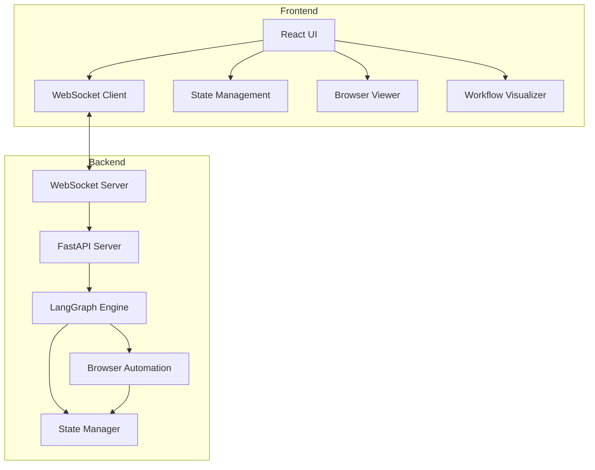

# LangGraph Browser Automation System

A powerful browser automation system built with LangGraph, featuring real-time visualization and human-in-the-loop capabilities.

## Overview

The LangGraph Browser Automation System is a sophisticated framework that combines the power of LangGraph with browser automation to create an intelligent, interactive automation solution. This system stands out by providing real-time visual feedback and enabling human intervention when needed, making it ideal for complex automation tasks that require oversight and decision-making.

### Key Features

- **Intelligent Browser Automation**
  - LangGraph-powered automation logic
  - Smart decision-making capabilities
  - Flexible control flow with state management
  - Error recovery and resilience

- **Real-Time Visualization**
  - Live browser state updates
  - Interactive workflow visualization
  - Progress tracking and status indicators
  - Visual feedback for automation steps

- **Human-in-the-Loop Integration**
  - Seamless human intervention points
  - Interactive decision prompts
  - Manual override capabilities
  - Guided automation assistance

- **WebSocket-Based Communication**
  - Real-time bidirectional updates
  - Low-latency state synchronization
  - Reliable connection management
  - Automatic reconnection handling

### Tech Stack

- **Frontend**
  - React with TypeScript
  - shadcn-ui components
  - Tailwind CSS for styling
  - Real-time WebSocket client

- **Backend**
  - FastAPI application server
  - LangGraph for workflow management
  - Playwright for browser automation
  - WebSocket server for real-time communication

### Use Cases

- Complex web automation workflows
- Interactive scraping tasks
- Automated testing with human verification
- Web-based workflow automation
- Data extraction with validation
- UI testing with manual checkpoints

## Project Status

🚀 Active Development | 📦 Production Ready

---

## Architecture

The LangGraph Browser Automation System follows a modern, distributed architecture that enables real-time interaction between the frontend interface and backend automation engine.

### System Architecture



### Frontend Architecture

The frontend is built with React and TypeScript, utilizing a component-based architecture:

#### Core Components
- **Browser View** (`src/components/browser/`)
  - Real-time browser state visualization
  - Interactive control interface
  - Screenshot rendering

- **Workflow Visualizer** (`src/components/agent/`)
  - Automation progress tracking
  - Step-by-step visualization
  - State transition display

- **Chat Interface** (`src/components/chat/`)
  - User interaction
  - Command input
  - Status updates

#### State Management
- Custom hooks for state management
- WebSocket integration for real-time updates
- Browser automation state handling
- Chat and workflow state coordination

### Backend Architecture

The backend is powered by FastAPI and LangGraph:

#### Core Modules
- **FastAPI Application** (`backend/app/`)
  - HTTP endpoints
  - WebSocket server
  - State management
  - Error handling

- **LangGraph Integration** (`backend/app/lang_graph/`)
  - State graph management
  - Node type definitions
  - Workflow execution
  - Decision making

- **Browser Automation** (`backend/app/browser/`)
  - Playwright integration
  - Action handlers
  - Screenshot capture
  - Error recovery

- **Models** (`backend/app/models/`)
  - State definitions
  - Message schemas
  - Type definitions

### File Structure

```
project/
├── src/
│   ├── components/
│   │   ├── browser/      # Browser visualization
│   │   ├── agent/        # Workflow components
│   │   ├── chat/         # User interaction
│   │   └── ui/           # Shared UI components
│   ├── hooks/            # Custom React hooks
│   ├── lib/              # Utility functions
│   └── pages/            # Route components
└── backend/
    └── app/
        ├── lang_graph/   # LangGraph implementation
        ├── browser/      # Browser automation
        ├── models/       # Data models
        └── websocket.py  # WebSocket handling
```

### Communication Flow

1. User inputs are captured by the React frontend
2. Commands are sent via WebSocket to the backend
3. FastAPI server processes requests through LangGraph
4. Browser automation is executed based on the workflow
5. State updates are sent back to the frontend
6. UI updates in real-time with new states

### Security Considerations

- Secure WebSocket connections
- Input validation and sanitization
- Rate limiting on API endpoints
- Error handling and recovery
- Session management
- Authentication integration

## Installation and Setup

### Prerequisites

- Node.js >= 16.x and npm >= 8.x
- Python >= 3.8
- Git

### Clone and Directory Setup

```bash
# Clone the repository
git clone <repository-url>
cd <repository-name>
```

### Backend Setup

1. **Create Python Virtual Environment**
```bash
# Create and activate virtual environment
python -m venv venv
source venv/bin/activate  # On Windows: .\venv\Scripts\activate
```

2. **Install Python Dependencies**
```bash
cd backend
pip install -r requirements.txt

# Install Playwright browsers
playwright install
```

3. **Environment Configuration**
Create a `.env` file in the `backend` directory:
```bash
# Backend environment variables
OPENAI_API_KEY=your_api_key
JWT_SECRET=your_jwt_secret
ALLOWED_ORIGINS=http://localhost:3000
```

### Frontend Setup

1. **Install Node.js Dependencies**
```bash
# From the project root
npm install
```

2. **Environment Configuration**
Create a `.env` file in the project root:
```bash
# Frontend environment variables
VITE_API_URL=http://localhost:8000
VITE_WS_URL=ws://localhost:8000/ws
```

### Development Server Startup

1. **Start Backend Server**
```bash
# In the backend directory with venv activated
uvicorn app.main:app --reload --port 8000
```

2. **Start Frontend Development Server**
```bash
# In another terminal, from project root
npm run dev
```

The application should now be running at:
- Frontend: http://localhost:3000
- Backend API: http://localhost:8000
- API Documentation: http://localhost:8000/docs

### Environment Variables

#### Backend Variables
- `OPENAI_API_KEY`: Your OpenAI API key for LangGraph
- `JWT_SECRET`: Secret key for JWT token generation
- `ALLOWED_ORIGINS`: CORS allowed origins

#### Frontend Variables
- `VITE_API_URL`: Backend API base URL
- `VITE_WS_URL`: WebSocket server URL

### Troubleshooting

1. **Backend Issues**
   - Ensure Python virtual environment is activated
   - Verify all dependencies are installed
   - Check environment variables are set correctly
   - Confirm Playwright browsers are installed

2. **Frontend Issues**
   - Clear npm cache if dependency issues occur
   - Verify Node.js version compatibility
   - Check environment variables are set correctly
   - Ensure backend server is running

3. **WebSocket Connection**
   - Verify WebSocket URL is correct
   - Check CORS configuration
   - Ensure backend server is running
   - Check browser console for connection errors

## Usage Guide

### Basic Workflow

1. **Starting a Session**
   ```bash
   # Ensure both servers are running
   cd backend && uvicorn app.main:app --reload  # Terminal 1
   npm run dev                                  # Terminal 2
   ```

2. **Accessing the Interface**
   - Open http://localhost:3000 in your browser
   - Log in with your credentials
   - Navigate to the automation dashboard

### Browser Automation Features

1. **Basic Commands**
   ```typescript
   // Navigation
   await goto('https://example.com')
   await click('button.submit')
   await type('input#search', 'query')
   
   // Interaction
   await selectOption('select#country', 'USA')
   await checkBox('input#terms')
   await pressKey('Enter')
   
   // State Management
   await waitForElement('.loading')
   await screenshot('element.selector')
   ```

2. **Advanced Features**
   - Multiple browser contexts
   - Parallel execution
   - Error recovery
   - State persistence
   - Custom action sequences

### Human Intervention Points

1. **Manual Review**
   - Screenshot validation
   - Data verification
   - Decision points
   - Error resolution

2. **Intervention Types**
   ```typescript
   // Request user input
   const userInput = await requestInput('Please verify the data')
   
   // Decision point
   const proceed = await requestDecision('Continue with checkout?')
   
   // Manual correction
   const fixedData = await requestCorrection(data)
   ```

3. **Control Flow**
   - Pause/Resume workflow
   - Skip steps
   - Retry actions
   - Override decisions

### Real-time Visualization

1. **Browser View**
   - Live page preview
   - Element highlighting
   - Action feedback
   - Error indicators

2. **Workflow Status**
   - Progress tracking
   - Step completion
   - Error states
   - Performance metrics

3. **Debug Information**
   - Console output
   - Network requests
   - State changes
   - Error traces

### Common Use Cases

1. **Data Extraction**
   ```typescript
   // Example: Scraping product information
   async function scrapeProducts() {
     await goto('https://store.example.com')
     const products = await extractElements('.product-card', {
       title: '.product-title',
       price: '.product-price',
       description: '.product-desc'
     })
     await saveToDatabase(products)
   }
   ```

2. **Form Automation**
   ```typescript
   // Example: Automated form filling
   async function fillForm() {
     await goto('https://forms.example.com')
     await type('#name', userData.name)
     await type('#email', userData.email)
     await selectOption('#country', userData.country)
     await upload('#document', userData.file)
     await click('#submit')
   }
   ```

3. **Testing Workflows**
   ```typescript
   // Example: E2E test sequence
   async function testCheckout() {
     await login(credentials)
     await addToCart('product-1')
     await goto('/checkout')
     await fillShippingInfo(address)
     await fillPaymentInfo(payment)
     await verifyOrder()
     await submitOrder()
   }
   ```

### Best Practices

1. **Error Handling**
   - Always include try-catch blocks
   - Implement retry mechanisms
   - Log errors appropriately
   - Plan for recovery

2. **Performance**
   - Use efficient selectors
   - Minimize browser instances
   - Implement caching
   - Handle resource cleanup

3. **Security**
   - Validate input data
   - Handle sensitive information
   - Implement timeouts
   - Monitor resource usage

### Troubleshooting

1. **Common Issues**
   - Connection timeouts
   - Element not found
   - State synchronization
   - Resource limitations

2. **Debugging Tools**
   - Browser console
   - Network inspector
   - State viewer
   - Log analysis

3. **Performance Optimization**
   - Resource monitoring
   - Action timing
   - Memory management
   - Cache utilization

## API Reference

### WebSocket Events

The system uses WebSocket messages for real-time communication. Each message follows this structure:

```typescript
interface WebSocketMessage {
  type: MessageType;
  sessionId: string;
  payload: BrowserActionRequest | BrowserActionResponse | AgentThought | SystemEvent | ErrorMessage;
  timestamp: string;
  messageId: string;
}

type MessageType = 
  | 'browser_action'
  | 'workflow_update'
  | 'user_input'
  | 'agent_thought'
  | 'system_event'
  | 'error'
  | 'ping'
  | 'pong';
```

### Browser Automation Commands

#### Action Types

```typescript
type BrowserActionType = 
  | 'navigate'
  | 'click'
  | 'type'
  | 'wait'
  | 'screenshot'
  | 'scroll'
  | 'select';

interface BrowserActionRequest {
  action: BrowserActionType;
  params: Record<string, string | number | boolean | null>;
  timeout?: number;
}

interface BrowserActionResponse {
  success: boolean;
  action: BrowserActionType;
  result?: Record<string, string | number | boolean | null>;
  error?: string;
  timestamp: string;
}
```

#### Browser State

```typescript
interface BrowserState {
  url: string;
  title?: string;
  screenshot?: string;  // Base64 encoded image
  lastAction?: BrowserAction;
  lastActionTimestamp?: string;
  formData: Record<string, string>;
}
```

### State Management

#### Agent State

```typescript
interface AgentStatus {
  isThinking: boolean;
  currentStep: Step | null;
  progress: number;
  needsUserInput: boolean;
}

interface AgentThought {
  thought: string;
  plan?: string[];
  reasoning?: string;
  timestamp: string;
}
```

#### Chat State

```typescript
interface ChatState {
  messages: Message[];
  isProcessing: boolean;
  currentSteps: Step[];
}

interface Message {
  id: string;
  type: MessageType;  // 'user' | 'agent' | 'system'
  content: string;
  steps?: Step[];
  timestamp: number;
}
```

#### Workflow State

```typescript
interface WorkflowState {
  sessionId: string;
  currentStep?: Step;
  completedSteps: Step[];
  browserState: BrowserState;
  requiresInput: boolean;
  inputPrompt?: string;
  createdAt: string;
  updatedAt: string;
}

interface Step {
  id: string;
  content: string;
  status: StepStatus;  // 'pending' | 'processing' | 'completed' | 'error'
  timestamp: number;
}
```

### Error Handling

```typescript
interface ErrorMessage {
  code: string;
  message: string;
  details?: Record<string, string | number | boolean | null>;
  timestamp: string;
}

interface SystemEvent {
  eventType: string;
  details: Record<string, string | number | boolean | null>;
  severity: 'info' | 'warning' | 'error';
  timestamp: string;
}
```

### State Actions

```typescript
type ChatAction = 
  | { type: 'ADD_MESSAGE'; payload: Message }
  | { type: 'UPDATE_STEPS'; payload: Step[] }
  | { type: 'SET_PROCESSING'; payload: boolean }
  | { type: 'UPDATE_STEP_STATUS'; payload: { stepId: string; status: StepStatus } };
```

### WebSocket Communication Examples

1. **Sending a Browser Action**
```typescript
const message: WebSocketMessage = {
  type: 'browser_action',
  sessionId: 'session-123',
  payload: {
    action: 'click',
    params: { selector: '#submit-button' }
  },
  timestamp: new Date().toISOString(),
  messageId: 'msg-123'
};
```

2. **Receiving a Workflow Update**
```typescript
const message: WebSocketMessage = {
  type: 'workflow_update',
  sessionId: 'session-123',
  payload: {
    currentStep: {
      id: 'step-123',
      content: 'Clicking submit button',
      status: 'completed',
      timestamp: Date.now()
    }
  },
  timestamp: new Date().toISOString(),
  messageId: 'msg-124'
};
```

### API Best Practices

1. **Error Handling**
   - Always include timeout parameters
   - Implement retry logic for actions
   - Handle WebSocket disconnections
   - Validate input parameters

2. **State Management**
   - Keep state updates atomic
   - Implement optimistic updates
   - Handle race conditions
   - Cache state appropriately

3. **Performance**
   - Batch state updates
   - Minimize message payload size
   - Use efficient selectors
   - Implement debouncing

## Development Guide

### Project Structure Overview

```
project/
├── src/                      # Frontend source code
│   ├── components/           # React components
│   │   ├── browser/         # Browser automation UI
│   │   ├── agent/           # Agent and workflow UI
│   │   ├── chat/            # Chat interface
│   │   └── ui/              # Shared UI components
│   ├── hooks/               # Custom React hooks
│   │   ├── useChat.ts       # Chat state management
│   │   ├── useWebSocket.ts  # WebSocket connection
│   │   └── ...
│   ├── lib/                 # Utilities and types
│   │   ├── agentTypes.ts    # Agent interfaces
│   │   ├── browserTypes.ts  # Browser automation types
│   │   └── ...
│   └── pages/               # Route components
│
└── backend/                  # Backend source code
    └── app/
        ├── lang_graph/      # LangGraph implementation
        │   ├── nodes.py     # Graph node definitions
        │   └── workflow.py  # Workflow management
        ├── browser/         # Browser automation
        │   ├── actions.py   # Action handlers
        │   └── controller.py # Browser control
        └── models/          # Data models
```

### Key Components

#### Frontend Components

1. **BrowserView (`src/components/browser/BrowserView.tsx`)**
   - Renders browser state visualization
   - Handles user interaction with browser
   - Manages screenshot display
   - Provides action feedback

2. **WorkflowVisualizer (`src/components/agent/WorkflowVisualizer.tsx`)**
   - Displays automation progress
   - Shows step transitions
   - Indicates current state
   - Handles user intervention

3. **ChatInterface (`src/components/chat/`)**
   - Manages user-agent communication
   - Displays step status
   - Handles command input
   - Shows real-time updates

#### Backend Components

1. **LangGraph Integration (`backend/app/lang_graph/`)**
   - Defines node types and behaviors
   - Manages workflow execution
   - Handles state transitions
   - Coordinates decision making

2. **Browser Controller (`backend/app/browser/`)**
   - Implements action handlers
   - Manages browser instances
   - Handles screenshot capture
   - Provides error recovery

### State Management

#### Frontend State

1. **Chat State**
```typescript
// Using Chat Hook
const {
  messages,
  isProcessing,
  sendMessage,
  updateSteps
} = useChat();

// State Updates
const handleNewMessage = (message: Message) => {
  sendMessage(message);
  updateSteps(message.steps || []);
};
```

2. **Browser State**
```typescript
// Using Browser Hook
const {
  browserState,
  executeAction,
  updateScreenshot
} = useBrowserAutomation();

// Action Execution
const handleAction = async (action: BrowserAction) => {
  await executeAction(action);
  await updateScreenshot();
};
```

#### Backend State

1. **Workflow State**
```python
# State Graph Node
class BrowserActionNode(BaseNode):
    async def execute(self, state: WorkflowState) -> WorkflowState:
        action = state.current_action
        result = await self.browser_controller.execute(action)
        return state.update(result=result)
```

2. **Model Management**
```python
# State Models
class WorkflowState(BaseModel):
    session_id: str
    current_step: Optional[Step]
    browser_state: BrowserState
    requires_input: bool = False
```

### Testing Approach

1. **Frontend Testing**
```typescript
// Component Tests
describe('BrowserView', () => {
  it('renders screenshot', () => {
    const { getByTestId } = render(<BrowserView />);
    expect(getByTestId('browser-screenshot')).toBeInTheDocument();
  });
});

// Hook Tests
describe('useWebSocket', () => {
  it('handles connection', () => {
    const { result } = renderHook(() => useWebSocket());
    expect(result.current.isConnected).toBe(true);
  });
});
```

2. **Backend Testing**
```python
# Action Tests
async def test_browser_action():
    controller = BrowserController()
    result = await controller.execute({
        'action': 'click',
        'params': {'selector': '#button'}
    })
    assert result.success == True

# Workflow Tests
async def test_workflow_execution():
    graph = StateGraph()
    result = await graph.execute(initial_state)
    assert result.status == 'completed'
```

### Contributing Guidelines

1. **Code Style**
   - Follow TypeScript/Python style guides
   - Use meaningful variable names
   - Document complex logic
   - Write comprehensive tests

2. **Pull Request Process**
   - Create feature branch
   - Write tests for new features
   - Update documentation
   - Submit PR with description

3. **Commit Guidelines**
   ```
   feat: Add new browser action
   fix: Resolve WebSocket reconnection
   docs: Update API documentation
   test: Add workflow tests
   refactor: Improve state management
   ```

### Development Workflow

1. **Setup Development Environment**
   ```bash
   # Clone repository
   git clone <repo-url>
   cd <repo-name>

   # Install dependencies
   npm install
   cd backend && pip install -r requirements.txt
   ```

2. **Start Development Servers**
   ```bash
   # Terminal 1: Frontend
   npm run dev

   # Terminal 2: Backend
   cd backend && uvicorn app.main:app --reload
   ```

3. **Development Process**
   - Write tests first (TDD approach)
   - Implement features
   - Run test suite
   - Submit pull request

### Performance Optimization

1. **Frontend Optimization**
   - Implement React.memo for heavy components
   - Use virtualization for long lists
   - Optimize WebSocket message size
   - Cache browser screenshots

2. **Backend Optimization**
   - Pool browser instances
   - Implement request queuing
   - Cache frequent operations
   - Optimize database queries

### Monitoring and Debugging

1. **Frontend Monitoring**
   - Browser console logging
   - Network request tracking
   - Performance profiling
   - Error boundary handling

2. **Backend Monitoring**
   - Log file management
   - Error tracking
   - Performance metrics
   - Resource monitoring

### Security Considerations

1. **Input Validation**
```typescript
// Frontend validation
const validateAction = (action: BrowserAction): boolean => {
  if (!action.type || !ALLOWED_ACTIONS.includes(action.type)) {
    throw new Error('Invalid action type');
  }
  return true;
};
```

2. **Authentication**
```typescript
// Token validation
const validateToken = async (token: string): Promise<boolean> => {
  try {
    const decoded = await verifyJWT(token);
    return isValidUser(decoded);
  } catch {
    return false;
  }
};
```

3. **Rate Limiting**
```python
# Backend rate limiting
@app.middleware("http")
async def rate_limit(request: Request, call_next):
    client_id = request.client.host
    if await is_rate_limited(client_id):
        raise HTTPException(429)
    return await call_next(request)
```

### Troubleshooting Guide

1. **Common Issues**
   - WebSocket connection failures
   - Browser automation timeouts
   - State synchronization errors
   - Resource exhaustion

2. **Debug Tools**
   - Browser DevTools
   - Backend logging
   - State inspectors
   - Network analyzers

3. **Resolution Steps**
   - Check logs first
   - Verify configurations
   - Test in isolation
   - Review recent changes
